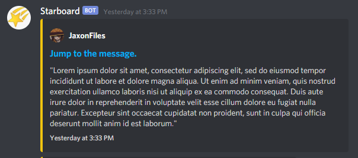

# Starboard

---

## About
Starboard is a Discord bot made in Rust using [serenity](https://github.com/serenity-rs/serenity)
for saving memorable moments and messages to a
specified channel in your guild based on the number of a certain reaction
it receives. By default, this is 5 ⭐ emotes. Below is an example of the message
the bot will send to the specified channel.

## Features
You can use the following commands to customize your starboard:
* `.channel <channel id>`
* `.emote <emote>`
* `.threshold <number>`

The channel id will be a number like `780245624834097203`. You can get a channel's id by sending a message with #channel and then escaping the tag: `\#channel`. This will produce a message with something like `<#780245624834097203>`. This is where posts that are saved to starboard will be added to by the bot. A suggestion is to make a separate channel called `#starboard` where you just let starboard post those saved messages as a "storage channel."

The default emote is ⭐. If you wish to change this, use the emote command followed by the emote that you'd like to use for the starboard. For example, you could do `.emote :pogsire:`. Do not escape the emote with a backslash.

The threshold is the number of reacts needed for a message to be added to starboard. The default value for this is 5. You can change it with the threshold command followed by an unsigned 32-bit integer.